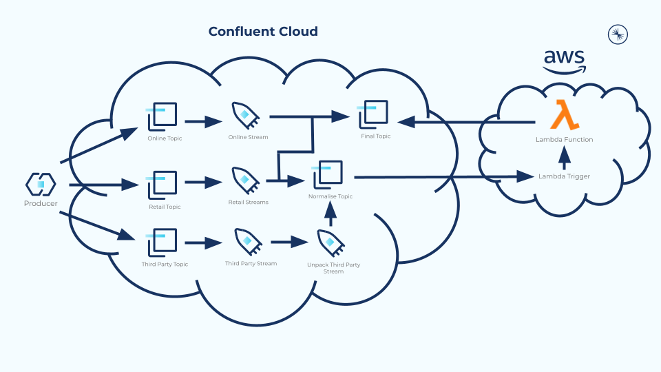

# AWS Normalise Demo


This demo implements Confluent Cloud and AWS to normalise mortgage application data, we achieve this using ksqlDB and AWS Lambda. Our topics receive mortgage application messages. Online receives already normalised messages. Retail receives normalised and unnormalised messages at random. Third Party receives nested unnormalised messages.
KsqlDB is used to filter messages and unpack nested messages. Our AWS Lambda function uses the normalise topic as a trigger, normalising the message data. Finally, the Lambda produces those normalised messages to our final topic.



## Prerequisites
- Access to Confluent Cloud
- Access to AWS
- Docker

## Producer
- Create three topics within Confluent Cloud named 'online', 'retail', and 'thirdparty'
- Edit cloud.config by entering your credentials
- `cd lambda-demo-producer`
- Run this command: `docker build -t lambda-producer .`
- Run this command: `docker run lambda-producer`

## ksqlDB
- Within Confluent Cloud, create a ksqlDB cluster
- Enter these ksqlDB statements into the Editor
```
CREATE STREAM onlinestream WITH (KAFKA_TOPIC='online', VALUE_FORMAT='AVRO');
CREATE STREAM retailstream WITH (KAFKA_TOPIC='retail', VALUE_FORMAT='AVRO');
CREATE STREAM thirdpartystream WITH (KAFKA_TOPIC='thirdparty', VALUE_FORMAT='AVRO');

CREATE STREAM unpackedthirdpartystream WITH (KAFKA_TOPIC='unpackedthirdparty') AS SELECT
EXPLODE(nestedmessages)->Applicants AS Applicants,
EXPLODE(nestedmessages)->DEPOSIT AS DEPOSIT,
EXPLODE(nestedmessages)->PROPERTYADDRESS AS PROPERTYADDRESS,
EXPLODE(nestedmessages)->PROPERTYVALUE AS PROPERTYVALUE,
EXPLODE(nestedmessages)->SOFTWAREVERSION AS SOFTWAREVERSION,
EXPLODE(nestedmessages)->SOURCE AS origin,
SOURCE AS SOURCE
FROM thirdpartystream PARTITION BY SOURCE EMIT CHANGES;

CREATE STREAM finalstream WITH (KAFKA_TOPIC='final') AS SELECT
Applicants AS Applicants,
DEPOSIT AS DEPOSIT,
PROPERTYADDRESS AS PROPERTYADDRESS,
PROPERTYVALUE AS PROPERTYVALUE,
SOFTWAREVERSION AS SOFTWAREVERSION,
AS_VALUE(SOURCE) AS origin,
SOURCE as SOURCE
FROM onlinestream PARTITION BY SOURCE EMIT CHANGES;

CREATE STREAM normalisestream WITH (KAFKA_TOPIC='normalise') AS SELECT
Applicants AS Applicants,
DEPOSIT AS DEPOSIT,
PROPERTYADDRESS AS PROPERTYADDRESS,
PROPERTYVALUE AS PROPERTYVALUE,
SOFTWAREVERSION AS SOFTWAREVERSION,
AS_VALUE(SOURCE) AS origin,
SOURCE as SOURCE
FROM unpackedthirdpartystream PARTITION BY SOURCE EMIT CHANGES;

INSERT INTO finalstream SELECT 
Applicants AS Applicants,
DEPOSIT AS DEPOSIT,
PROPERTYADDRESS AS PROPERTYADDRESS,
PROPERTYVALUE AS PROPERTYVALUE,
SOFTWAREVERSION AS SOFTWAREVERSION,
AS_VALUE(SOURCE) AS origin,
SOURCE as SOURCE
FROM retailstream WHERE SOFTWAREVERSION >= 5 PARTITION BY SOURCE EMIT CHANGES;

INSERT INTO normalisestream SELECT 
Applicants AS Applicants,
DEPOSIT AS DEPOSIT,
PROPERTYADDRESS AS PROPERTYADDRESS,
PROPERTYVALUE AS PROPERTYVALUE,
SOFTWAREVERSION AS SOFTWAREVERSION,
AS_VALUE(SOURCE) AS origin,
SOURCE as SOURCE
FROM retailstream WHERE SOFTWAREVERSION < 5 PARTITION BY SOURCE EMIT CHANGES;
```

## AWS Lambda
- Enure your Confluent Cloud cluster and all of your AWS resources are hosted within the same region (e.g. eu-west-1)

#### CloudFormation
- Log in to your AWS account, search AWS for the CloudFormation service
- From the CloudFormation homepage, click *Create Stack*
    - Create stack:
        - Select *Template is ready*
        - Select *Upload a template file*
        - Upload the *aws-normalise-demo-stack-template* file provided with this repo
    - Specify stack details:
        - Name your stack, e.g. aws-normalise-demo-stack
        - Enter your Confluent Cloud Credentials
    - Configure stack options:
        - Keep defaults
    - Review:
        - Check the option: *I acknowledge that AWS CloudFormation might create IAM resources*
        - Click *Create Stack*

#### Lambda Function
- Search AWS for the Lambda service
- Click *Create Function* and use the *Author from scratch* option
    - Name your Lambda function, e.g. aws-normalise-demo-lambda
    - Runtime: Python 3.7
    - Under Permissions select *Use an existing role* and then select the role created by your CloudFormation stack
        - The role created uses the name of your stack followed by 'ConfluentLambdaRole', e.g. aws-normalise-demo-stack-ConfluentLambdaRole-...

#### Lambda Layer
- Open the AWS Lambda sidebar and select *Layers*, found under *Additional resources*
- Click the *Create layer* button
- Create Layer configs
    - Name your layer
    - Upload the lambda_layer.zip provided with this repo
    - Compatible runtimes: Python 3.7
    - Click *Create*
- Navigate to your Lambda function page and scroll down to *Layers*
    - Click *Add a layer*
    - Select the *Custom layers* option
    - Choose the layer you created 
    - Click *Add*

#### Lambda Environment Variables
- Search AWS for the Key Management Service
- Click *Create key*
    - Use default configurations
    - Add an alias
    - Under *Key administrators* choose these roles:
        - The role created by your CloudFormation stack
        - The IAM user/role that you used to log in to AWS, e.g. administrator
    - Check the option *Allow key administrators to delete this key*
    - Apply *key usage permissions* to the same roles outlined above
    - Review your Key configuration and click *Finish*
- Navigate to your Lambda function page and select the *Configuration* tab
- Under *Environment Variables* click *Edit*
- Add environment variables and assign their required values for:
    - basic_auth_user_info
    - sasl_username
    - sasl_password
    - schema_registry_url
    - boostrap_servers
- Under *Encryption configuration*
    - Check *Enable helpers for encryption in transit* 
    - Encrypt each of your environment variables
    - Under *AWS KMS key to encrypt in transit* select your KMS key and click *Encrypt*
    - Select *Use a customer master key* and then choose your KMS key
- Click *Save*

#### Lambda Function code
- Navigate to your Lambda function and select the *Code* tab
- Enter the code from the lambda_function_code.py file cloned from this repo into the lambda_function.py within your Lambda
- Ensure the Lambda function name (currently set to 'aws-normalise-demo-function') passed on line 72 matches the name of your Lambda function

#### Kafka Trigger
- Navigate to your Lambda function and select *Add Trigger*
- From *Trigger Configuration* select *'*Apache Kafka*
- Apply these configurations:
    - Bootstraps servers: <'Your Confluent Cloud Bootstrap server'>
    - Topic Name: *normalise*
    - Authentication: 
        - BASIC_AUTH: *Confluent_Credentials*
    - Click *Add*

#### Verification
- Review CloudWatch Logs within AWS to view messages that are being produced by your Lambda function
- Enter these ksqlDB statements into ksqlDB Editor to review the contents of the final topic
```
SELECT *
  FROM finalstream
  WHERE ORIGIN = 'retail'
  LIMIT 10;
  
  SELECT *
  FROM finalstream
  WHERE ORIGIN = 'online'
  LIMIT 10;
  
  SELECT *
  FROM finalstream
  WHERE ORIGIN = 'thirdparty'
  LIMIT 10;
```